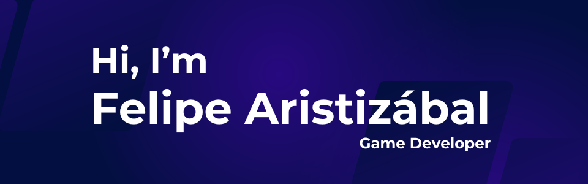

  

## About Me 🚀
I'm currently wrapping up my eight semester in Multimedia Engineering at the **Universidad Autónoma de Occidente**. 
Diving deep into the realms of coding, I've cultivated a fervent passion for game development, harnessing the versatile power of C# to bring immersive experiences to life.
I'm also passionate about the power of Python and its applications in Machine Learning and Deep Learning. 

## My Interests ✨
- **Game Development:** Crafting engaging video games and experimenting with innovative gameplay mechanics.
- **Machine Learning & Deep Learning:** Exploring advanced algorithms and neural networks to create intelligent systems.
- **Artificial Intelligence in Games:** Utilizing reinforcement learning to create adaptive and intelligent game behaviors.

## Technologies 🛠️

## My Stats :bar_chart:

## Projects 🛠️

### Volleyball VR
- **Repo:** [VolleyballVR](https://github.com/Felipe-Aristizabal/VolleyballVR)
- **Video:** [YouTube](https://youtu.be/3O3-zCHomNg)
- **Gameplay preview** [YouTube](https://youtu.be/Q9HDyEdeKGY)
- **Description:** Welcome to VolleyBall VR, an immersive virtual reality experience that brings the dynamic game of volleyball to your fingertips. Developed at the Colivri Lab at Universidad de Los Andes for the Mixed Reality Application Development course, led by Professor Pablo Figueroa, this project showcases the innovative use of HTC Vive Pro 2 and trackers to simulate real-life volleyball actions in a stunning virtual beach setting.
- **Responsabilities:** All the development.

### What A Fart!
- **Repo:** [WhatAFart](https://github.com/haruyoshie/WhatAFart)
- **Itch:** [Itch.io](https://haruyoshie.itch.io/what-a-fart)
- **Description:** What A Fart! is a unique strategy game developed during the Global Game Jam 2024 at Globant Connecta. Players step into the shoes of Gus Gastro, a waiter who despises customer service. The game combines humor and strategy as Gus must consume "harmful" food to power up his fart meter and strategically release gas to clear the restaurant of customers, all while avoiding getting caught.
- **Responsabilities:**
- - Particle system collision
  - Interfaces implementation
  - Navigation through interfaces
  
### Click and Count
- **Video:** [YouTube](https://www.youtube.com/watch?v=PyyoOLAjhYI)
- **Itch:** [Itch.io](https://felipe-aristizabal.itch.io/clickandcount)
- **Repo:** [ClickAndCount](https://github.com/Felipe-Aristizabal/ClickAndCount)
- **Description:** "Click and Count" is an adrenaline-pumping game where precision and pace go hand in hand. Dive into a world where every click counts, and time is of the essence. Your mission: to click all objects on the screen before time slips away.
- **Responsabilities:** All the development.

### Pneumonia Detection
- **Repo:** [MLDS_U6_PROYECTO_FINAL_ARISTIZABAL_RENDON](https://github.com/SRENDONP/MLDS_U6_PROYECTO_FINAL_ARISTIZABAL_RENDON)
- **Description:** This project involves implementing transfer learning for a machine learning model to detect pneumonia from X-ray images. By leveraging pre-trained models, the project achieves high accuracy and efficiency in classification, contributing significantly to the medical field by optimizing diagnosis and patient management processes.
- **Responsabilities:**
-  - Model training
   - Deploy the application as a web service

### Traffic-Sign-Classifier
- **Video:** [YouTube](https://www.youtube.com/watch?v=L51mIgqJ7Gw)
- **Repo:** [Traffic-Sign-Classifier](https://github.com/Felipe-Aristizabal/Traffic-Sign-Classifier)
- **Description:** In a quest to educate fifth graders on road safety, this project presents a real-time traffic sign classifier. Built with Python and InceptionV3, it's a tool for the young minds in Santiago de Cali to learn about road signs effectively, with an impressive accuracy rate, thanks to the robust neural network architectures employed.
- **Responsabilities:**
- - Preprocess the data
  - Model training
  - Model selection

### SpeechRecognition-ML
- **Repo:** [Tetris-speech-recognition](https://github.com/Hector-f-Romero/Tetris-speech-recognition)
- **Description:** Dive into the world of voice-controlled gaming with this innovative project. By combining signal processing, audio feature extraction, and machine learning, this game responds to voice commands in Spanish, offering a hands-free gaming experience that pushes the boundaries of interactive play.
- **Responsabilities:**
- - Preprocess the data
  - Model training
  - Model selection

### RedAndBlackRV
- **Video:** [YouTube](https://www.youtube.com/watch?v=dVKjkgNaql0)
- **Repo:** [RedAndBlackRV](https://github.com/Felipe-Aristizabal/RedAndBlackRV)
- **Description:** Experience the thrill of a casino in VR with Red And Black RV. This game, designed for Oculus DK2 and Leap Motion, places you in the shoes of a university student at a roulette table, gambling tuition fees for a chance to win big. It's a daring blend of reality and virtual excitement, posing the question: will you risk it all?
- **Responsabilities:**
- - Logic for betting
  - Animation controller development

### Ty's Dream
- **Repo** [Ty's Dream](https://github.com/Felipe-Aristizabal/Ty-s-Dream)
- **Description:** Timmy's Mind Adventure is an immersive adventure game developed using Unity. The project was undertaken with the aim of utilizing prior knowledge and independent work. The player embarks on a journey through the subconscious mind of Timmy, a young boy who must navigate his imagined world after a head injury.
- **Responsabilities:**
- - AI Enemy
  - Animation controller development

## Collaborate with Me 🤝
I'm on a quest to merge AI with multimedia to not just play games but to create rich, dynamic experiences. If you're interested in 
pushing the boundaries of technology and creativity, I'd love to hear from you!

## Find Me Elsewhere 🌐

## Let's Build Something Amazing Together!
Feel free to reach out for collaborations or just a chat about tech, games, and AI. I'm always open to new ideas and opportunities.

